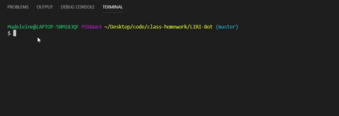

# LIRI-Bot
A command line interface node app that takes in parameters for finding music, bands, and movies.

## Description

You can user LIRI with the following commands:

1. concert-this: Search for a band to find concert information using the [Bands In Town API](https://manager.bandsintown.com/support/bandsintown-api). Displays the venue, city, and date of each concert coming up for that band.

2. movie-this: Search for a movie by name on [OMDb](http://www.omdbapi.com/). Displays the title, year of release, ratings, country of production, language, actors, and a plot summary.

3. spotify-this-song: Search for information about a song by name using the Spotify API. Displays the track name, artist name, albumn name, and a link to the song's preview.

4. do-what-it-says: reads a search command from a text file called random.txt and runs it.

## Usage
1. `node liri.js concert-this <artist/band name>`
  * Without an artist or band name the search will default to the song "the Sign".

2.  `node liri.js movie-this <movie name>`
  * Without a movie name the search will default to the movie "Mr. Nobody".
        
